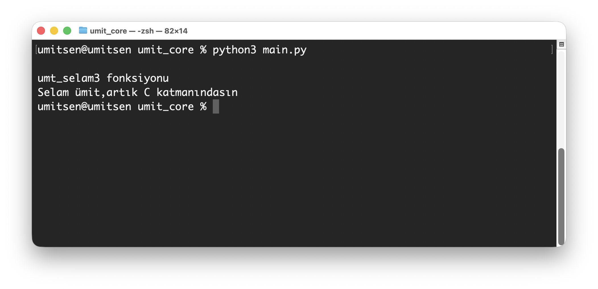
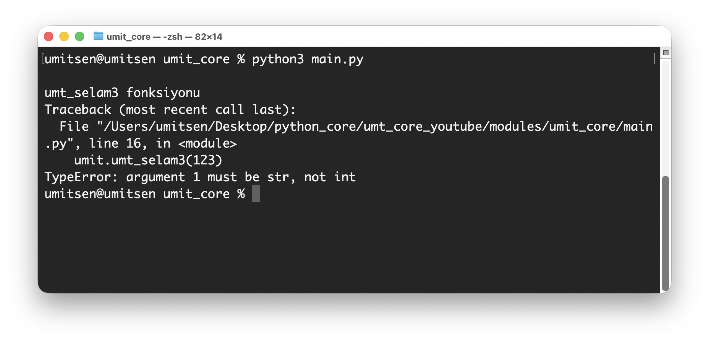

# Lesson 04 — PyArg_ParseTuple

Video : [https://www.youtube.com/watch?v=ol2nEAufYEw](https://www.youtube.com/watch?v=ol2nEAufYEw)

Playlist : [https://www.youtube.com/playlist?list=PLWmM3tw4zswZAjVf1qgPKt0mIfbxEhYpa](https://www.youtube.com/playlist?list=PLWmM3tw4zswZAjVf1qgPKt0mIfbxEhYpa)

## What we learn
- PyArg_ParseTuple
- string parse
- TypeError

## outputs
### string parse and print
  

### TypeError
  
