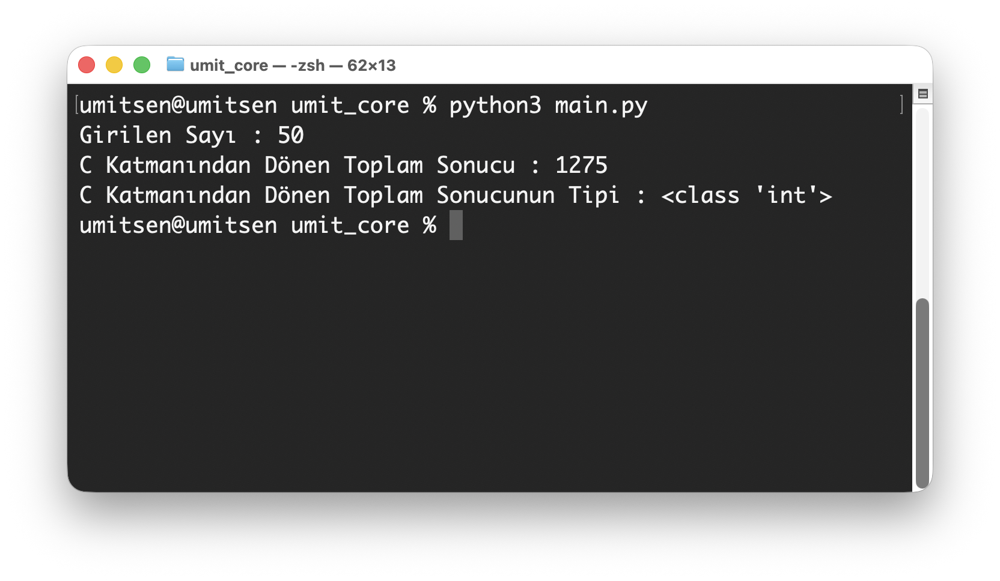

# Video 05
- Video : [https://youtu.be/6N2fqGMQ41c](https://youtu.be/6N2fqGMQ41c)
- Playlist : [https://www.youtube.com/playlist?list=PLWmM3tw4zswZAjVf1qgPKt0mIfbxEhYpa](https://www.youtube.com/playlist?list=PLWmM3tw4zswZAjVf1qgPKt0mIfbxEhYpa)

[🇹🇷 Türkçe Anlatım](#türkçe-anlatım) | [🇺🇸 English Description](#english-description) | [Playlist](#playlist)

"Python Çekirdek Kodlama (Python Core Programming)" serimizin bu bölümünde, Python'dan C katmanına tamsayı (integer) verilerini nasıl göndereceğimizi ve bu verilerle C tarafında nasıl işlemler yapacağımızı detaylandırıyoruz.

📌 Bu videoda neler öğreneceksiniz?

- *Integer Veri Gönderimi:* Python'daki bir tamsayıyı C fonksiyonuna parametre olarak geçme.
- *PyArg_ParseTuple Kullanımı:* "i" format belirteci ile Python objelerini C'deki int tipine dönüştürme.
- *Veri Döndürme (PyLong_FromLong):* C tarafında işlenen veriyi tekrar Python'un anlayacağı bir objeye paketleyip geri gönderme.
- *Opsiyonel Parametreler:* Pipe (|) operatörü kullanarak fonksiyonlara nasıl varsayılan değerler ve isteğe bağlı parametreler ekleneceğini keşfetme.
- *Pratik Örnek:* C tarafında bir döngü kurarak sayıların toplamını hesaplayan bir fonksiyonun Python extension olarak yazılması.

Python'un performansını C ile artırmak ve dilin derinliklerine inmek isteyenler için hazırladığım bu teknik rehber, extension yazımındaki kritik kuralları ve parametre yönetimini kapsamaktadır.

# Lesson 05 — integer default / optional parameter

## What we learn
- PyArg_ParseTuple
- string parse
- TypeError

## outputs
### integer default / optional parameter output
  

"Python Çekirdek Kodlama (Python Core Programming)" serimizin bu bölümünde, Python'dan C katmanına tamsayı (integer) verilerini nasıl göndereceğimizi ve bu verilerle C tarafında nasıl işlemler yapacağımızı detaylandırıyoruz.

📌 Bu videoda neler öğreneceksiniz?

- *Integer Veri Gönderimi:* Python'daki bir tamsayıyı C fonksiyonuna parametre olarak geçme.
- *PyArg_ParseTuple Kullanımı:* "i" format belirteci ile Python objelerini C'deki int tipine dönüştürme.
- *Veri Döndürme (PyLong_FromLong):* C tarafında işlenen veriyi tekrar Python'un anlayacağı bir objeye paketleyip geri gönderme.
- *Opsiyonel Parametreler:* Pipe (|) operatörü kullanarak fonksiyonlara nasıl varsayılan değerler ve isteğe bağlı parametreler ekleneceğini keşfetme.
- *Pratik Örnek:* C tarafında bir döngü kurarak sayıların toplamını hesaplayan bir fonksiyonun Python extension olarak yazılması.

Python'un performansını C ile artırmak ve dilin derinliklerine inmek isteyenler için hazırladığım bu teknik rehber, extension yazımındaki kritik kuralları ve parametre yönetimini kapsamaktadır.
